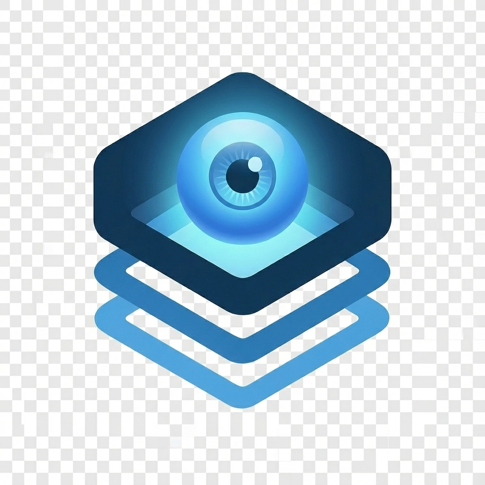

<!-- <div align="center">
  
</div> -->

#  NoStack: AI Development Stack

A comprehensive, production-ready Docker-based development stack for building AI-powered applications. This stack integrates multiple AI/ML tools, workflow automation, vector databases, and memory systems into a unified development environment.

<!-- <div align="center">
  
</div> -->

##  What's included in the stack

The core stack (this repo) includes the most powerful & easy to to use open source AI agent services. The services are pre-configured and ready to use. Networking, storage, and other docker related headaches are handled for you. Just run the stack and start building AI agents.

| Tool | Description |
| :--- | :--- |
| **[n8n](https://n8n.io/)** | Low-code automation platform with over 400 integrations and advanced AI components. |
| **[Flowise](https://flowiseai.com/)** | No/low code AI agent builder, pairs very well with n8n. |
| **[Langflow](https://www.langflow.org/)** | Visual framework for building multi-agent AI applications and LLM flows. |
| **[OpenWebUI](https://openwebui.com/)** | ChatGPT-like interface to privately interact with your local models and agents. |
| **[Zep](https://www.getzep.com/)** | Long-term memory service for AI assistants, enabling personalized AI experiences. |
| **[Qdrant](https://qdrant.tech/)** | Open-source, high performance vector store. Included to experiment with different vector stores. |
| **[Neo4j](https://neo4j.com/)** | Graph database for building knowledge graphs and modeling complex relationships. |
| **[PostgreSQL](https://www.postgresql.org/)** | Robust relational database with `pgvector` extension for vector similarity search. |
| **[Redis](https://redis.io/)** | High-performance in-memory data store used for caching and message brokering. |

## 🚀 Quick Start

### Option 1: Automated Setup (Recommended)

We have included a setup script to get you up and running in seconds.

1.  **Clone the repository**:
    ```bash
    git clone <your-repo-url>
    cd nostack
    ```

2.  **Configure Environment**:
    ```bash
    cp .env.example .env
    # Edit .env with your preferred settings (optional but recommended)
    nano .env
    ```

3.  **Run the setup script**:
    ```bash
    python3 setup.py
    ```
    This script will check your prerequisites and start the entire stack.

### Option 2: Manual Setup

1.  **Clone the repository**:
    ```bash
    git clone <your-repo-url>
    cd nostack
    ```

2.  **Configure Environment**:
    ```bash
    cp .env.example .env
    nano .env
    ```

3.  **Start the Stack**:
    ```bash
    docker compose up -d
    ```

## 🏗️ Architecture


## 🌐 Service Access

Once the stack is running, you can access the services at the following URLs:

| Service | URL | Default Credentials |
| :--- | :--- | :--- |
| **n8n** | [http://localhost:5679](http://localhost:5679) | Create account on first visit |
| **Flowise** | [http://localhost:3002](http://localhost:3002) | No authentication by default |
| **Langflow** | [http://localhost:7860](http://localhost:7860) | Create account on first visit |
| **OpenWebUI** | [http://localhost:3005](http://localhost:3005) | Create account on first visit |
| **Neo4j** | [http://localhost:7475](http://localhost:7475) | User: `neo4j`, Pass: `password123` |
| **Redis Commander** | [http://localhost:8081](http://localhost:8081) | No authentication |
| **Qdrant Dashboard** | [http://localhost:6334/dashboard](http://localhost:6334/dashboard) | No authentication |

## 📂 Folder Structure

```
nostack/
├── config/                 # Configuration files for services
│   ├── init-db.sh          # Database initialization script
│   ├── langflow.env        # Langflow environment variables
│   ├── neo4j.conf          # Neo4j configuration
│   ├── openwebui.env       # OpenWebUI environment variables
│   ├── qdrant.yml          # Qdrant configuration
│   └── zep.yaml            # Zep configuration
├── data/                   # Persistent data storage (ignored by git)
│   ├── flowise/            # Flowise data
│   ├── langflow/           # Langflow data
│   ├── n8n/                # n8n data
│   ├── neo4j/              # Neo4j data
│   ├── qdrant/             # Qdrant data
│   ├── redis/              # Redis data
│   └── zep-nlp/            # Zep NLP cache
├── docs/                   # Documentation files
│   ├── architecture.svg    # Architecture diagram
│   └── ...                 # Other documentation
├── postgres-data/          # PostgreSQL data storage (ignored by git)
├── services/               # Source code for custom services
│   └── openwebui-backend/  # OpenWebUI backend source
├── .env.example            # Example environment variables
├── docker-compose.yml      # Main Docker Compose file
├── setup.py                # Automated setup script
└── README.md               # Project documentation
```

## ⚙️ Configuration

The stack uses multiple environment files:

- **`.env`**: Main configuration for all services
- **`config/langflow.env`**: Langflow-specific settings
- **`config/openwebui.env`**: OpenWebUI-specific settings

See [`.env.example`](.env.example) for all available configuration options.

### Key Configuration Options

#### PostgreSQL
```env
POSTGRES_USER=postgres
POSTGRES_PASSWORD=your_secure_password
POSTGRES_PORT=5435
```

#### Redis
```env
REDIS_PASSWORD=your_redis_password
REDIS_PORT=6380
```

#### n8n
```env
N8N_PORT=5679
N8N_BASIC_AUTH_USER=admin
N8N_BASIC_AUTH_PASSWORD=your_password
```

## 🧠 Design Philosophy

The entire infrastructure follows 4 universal layers used in modern AI developer stacks:

1.  **Orchestration**: Handles Docker services, networking, and environment variables (`docker-compose.yml`, `.env`).
2.  **Storage (Volumes)**: Persisted and local data for databases, vector stores, and app data. This ensures no service stores anything in hidden Docker volumes.
3.  **Services (Source Code / Apps)**: Every external application gets its own folder, allowing full customization and version tracking.
4.  **Configuration**: All config files live in `config/`, giving you full transparency over how each service is wired.

## 🗄️ Database Management

### PostgreSQL Databases

The stack automatically creates the following databases:
`maindb`, `n8n`, `flowise`, `zep`, `openwebui`, `langflow`

### Accessing PostgreSQL

```bash
# Using Docker
docker exec -it nostack-postgres psql -U postgres -d maindb

# Using external client
psql -h localhost -p 5435 -U postgres -d maindb
```

## 💻 Development

### OpenWebUI Development

The OpenWebUI backend is configured for development with live code reloading. Source code is mounted at `./services/openwebui-backend`.

```bash
# View logs
docker logs -f nostack-openwebui-backend

# Restart after config changes
docker compose restart openwebui-backend
```

See [docs/openwebui-development.md](docs/openwebui-development.md) for more details.

## 🔧 Troubleshooting

### Common Issues

-   **Port Conflicts**: If ports are in use, change them in `.env`.
-   **Service Won't Start**: Check logs with `docker logs nostack-<service-name>`.
-   **Database Issues**: Verify PostgreSQL health with `docker exec nostack-postgres pg_isready -U postgres`.

### Reset Everything

```bash
# Stop all services
docker compose down

# Remove all data (WARNING: This deletes all data!)
rm -rf data/ postgres-data/

# Start fresh
docker compose up -d
```

## 🤝 Contributing

Contributions are welcome! Please fork the repository and submit a Pull Request.

## 📝 License

This project is licensed under the MIT License - see the [LICENSE](LICENSE) file for details.

---

**Built with ❤️ for the AI development community**
